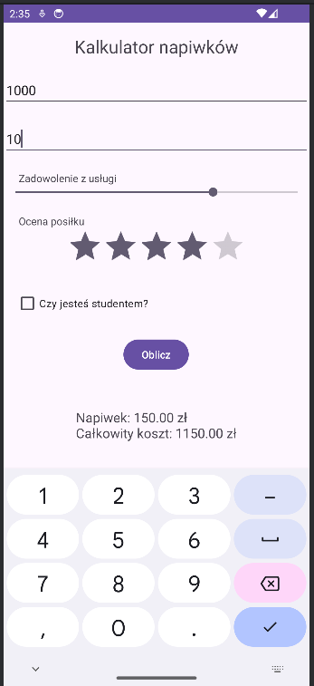
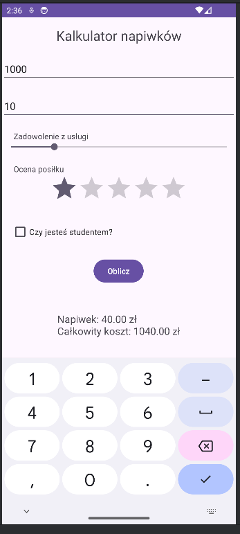
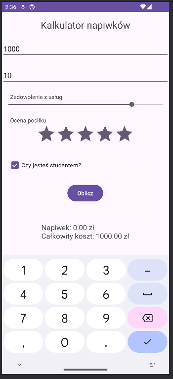

# WeSplit

**WeSplit** is a simple Swift-based iOS application built using SwiftUI. The app provides a clean and user-friendly interface for splitting bills among multiple people, making it perfect for quick calculations.

---

## 🛠️ Technologies and Tools
- **Language:** Swift
- **Framework:** SwiftUI
- **Development Environment:** Xcode

---

## 📱 App Features
- Calculate and split bills between a group of people.
- User-friendly interface with minimalistic design.
- Customizable options for tip percentage.
- Built using the latest SwiftUI framework.

---

## 🔍 Preview
Here are some screenshots of the app in action:

### Home Screen
<div style="display: flex; gap: 10px; justify-content: center;">
  
  
  
</div>

---

## 📂 Project Structure
- `WeSplitApp.swift` – Entry point of the application.
- `ContentView.swift` – Main user interface logic.
- `Assets.xcassets` – Application assets (icons, colors, etc.).
- `WeSplit.xcodeproj` – Xcode project configuration.

---

## 💻 Requirements
- **Xcode:** 12.0 or newer
- **iOS Version:** 14.0 or newer
- **Swift Version:** 5.3 or newer

---

## ⚙️ Installation and Running the App
1. Clone the repository:
   ```bash
   git clone https://github.com/Milosz-cat/WeSplit.git

2. Open the project in Xcode:
   ```bash
   Navigate to the cloned project folder.
   Double-click on the WeSplit.xcodeproj file to open it in Xcode.
